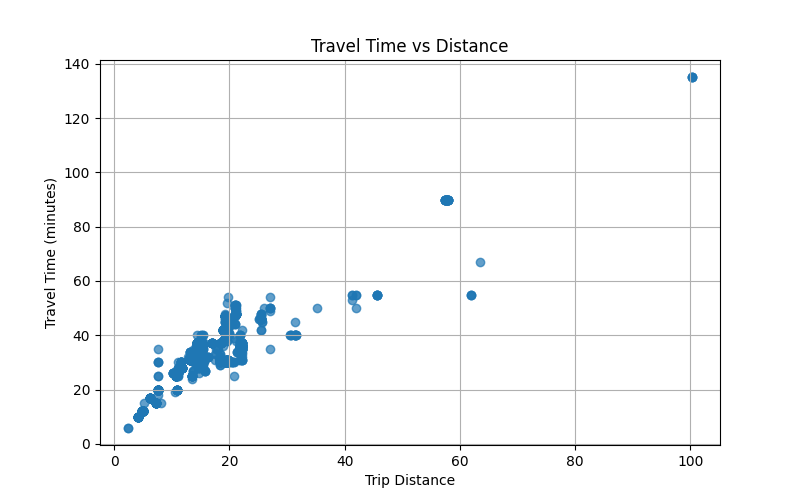
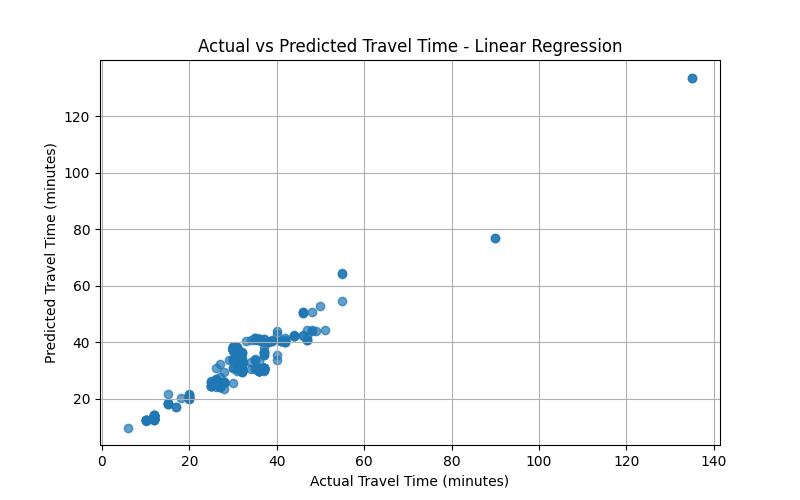
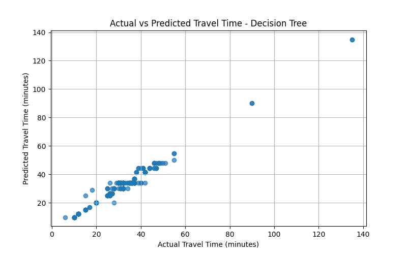

# Darwin Bus Travel Time Analysis

## Overview
This project predicts how long bus trips take in Darwin, Australia, using public transit data. It uses machine learning models (simple math equations and decision trees) to estimate travel times based on trip distance, number of stops, and start time. This can help riders plan their journeys better.

The analysis uses bus schedule data from the GTFS (General Transit Feed Specification) format, which is a standard way cities share public transit information.

## Prerequisites
- Python 3.8 or higher
- Basic understanding of running programs on your computer (or ask someone who does!)

## Setup Instructions
1. **Install Python**: If you don't have Python, download it from [python.org](https://www.python.org/downloads/).

2. **Download the Project**: This is already done if you're reading this!

3. **Install Required Libraries**:
   - Open a terminal/command prompt
   - Navigate to the project folder: `cd /Users/manishapaudel/Desktop/PRT564/google-transit-darwin (1)`
   - Run: `pip install pandas numpy matplotlib scikit-learn`

## Data Files
The project uses these GTFS data files (included in the folder):
- `stop_times.txt`: When buses arrive/depart at stops
- `trips.txt`: Trip details like route and service
- `stops.txt`: Stop locations
- `routes.txt`: Bus route information
- Other files like `calendar.txt`, `shapes.txt` for additional info

## How to Run the Analysis
1. Open a terminal/command prompt
2. Go to the project folder
3. Type: `python analysis.py`
4. Wait for it to finish (it will show text output and create images)

The program will:
- Load and clean the data
- Build two prediction models
- Show how well they work
- Create four graphs (saved as PNG files)

## Results Summary
After running, you'll see numbers like MAE, RMSE, and R². These measure how accurate the predictions are:
- **MAE (Mean Absolute Error)**: Average prediction error in minutes (lower is better)
- **RMSE (Root Mean Squared Error)**: Similar but penalizes big mistakes more (lower is better)
- **R² (R-squared)**: How much of the travel time variation the model explains (closer to 1.0 is better)

Typical results:
- Linear Regression: Simple but may not capture complex patterns
- Decision Tree: Can handle more complex relationships

## Output Figures
The analysis creates four PNG image files in the project folder. Open them with any image viewer.

### 1. Travel Time vs Distance
A scatter plot showing actual travel times plotted against trip distances. Points are bus trips. This helps see if longer trips take more time (they usually do).

### 2. Actual vs Predicted - Linear Regression
Compares real travel times to what the linear regression model predicted. Good predictions fall close to a diagonal line. Spread shows prediction errors.

### 3. Actual vs Predicted - Decision Tree
Same as above but for the decision tree model. Often more clustered around the ideal line if the model is better.

### 4. Predicted vs Actual - Linear Regression
Another view of linear regression predictions with a red dashed line showing perfect predictions. Points above the line are over-predictions, below are under-predictions.

## Troubleshooting
- If you get "Module not found" errors, run `pip install pandas numpy matplotlib scikit-learn` again
- If images don't save, make sure you have write permissions in the folder
- For Python beginners, search online for "how to run Python script on [your OS]"

## What This Means for Bus Riders
This analysis shows we can predict bus times using simple data. In real applications, this could improve transit apps, help city planners, or alert riders to delays. The models aren't perfect but provide a starting point for better predictions.
